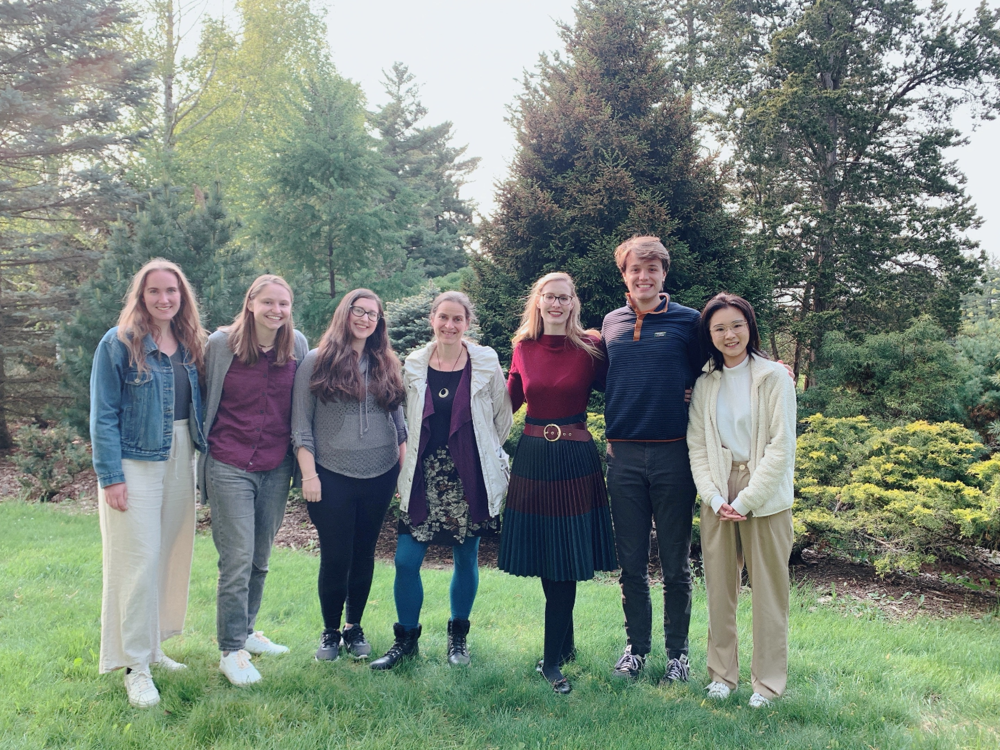
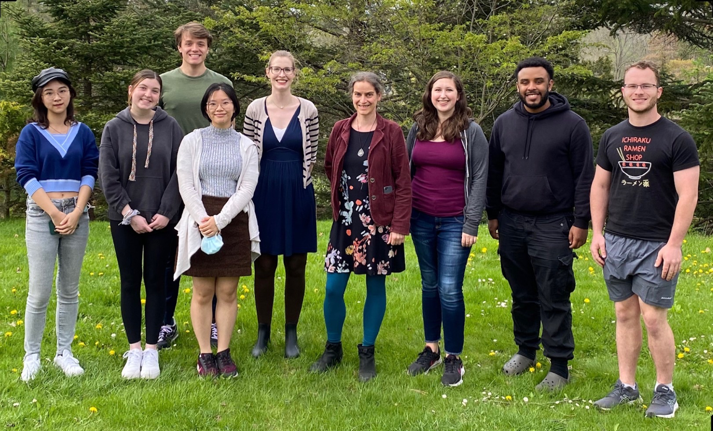

# Healthy Aging Lab
<!-- Image Gallery -->

  
  

<!-- End of Image Gallery -->

# Life Beyond Work

  

    In parallel to my research, I serve as a member of the Graduate Student Committee in the Psychology Department and a member of the Diversity and International Students Committee in the Graduate and Professional Student Assembly.
  

  

    
  

  

      
  

  

    I also work as a volunteering mentor for Extended Project Qualification, assisting high school students with their first social science projects. During my leisure, I enjoy spending time with my cats, handcrafting, and hiking. 
  

