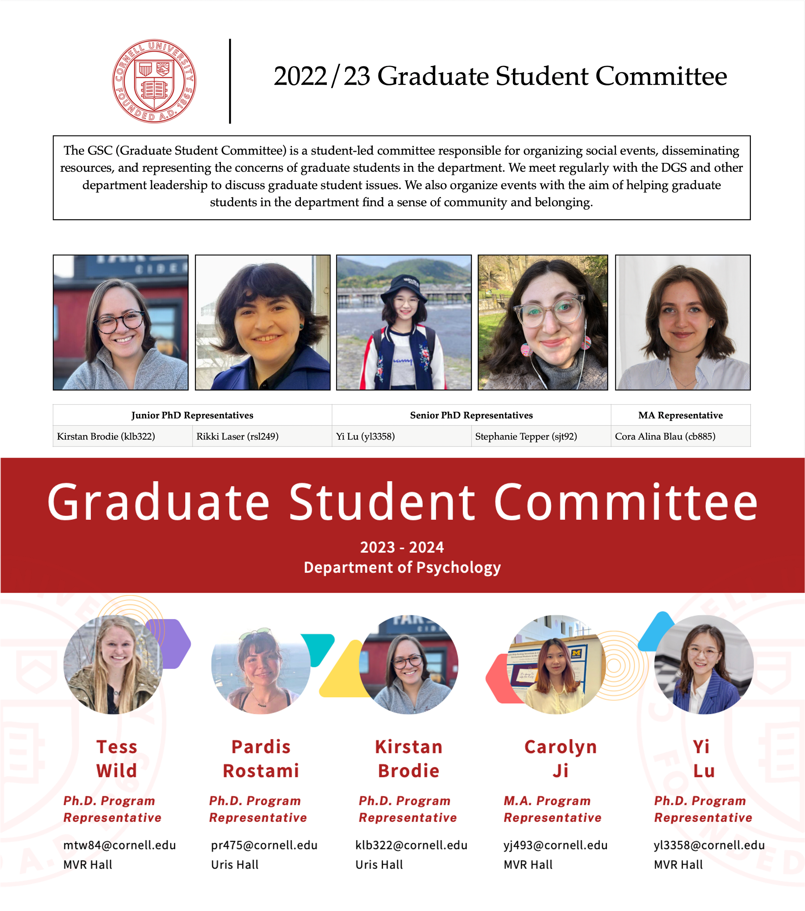
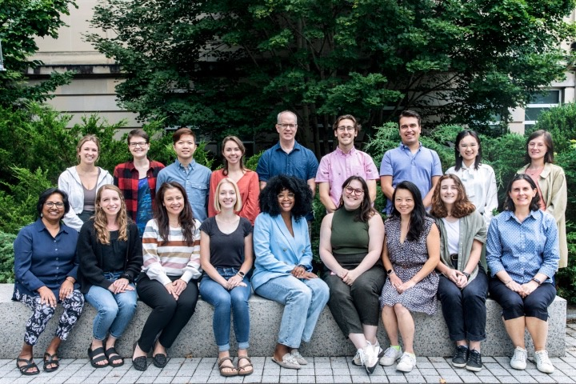

# Life Beyond Research
## Community Services
In parallel to my research, I serve as a senior graduate student representative in the Graduate Student Committee in the Psychology Department and as a founding member of the Diversity and International Students Committee (DISC) in the [Graduate and Professional Student Assembly](https://assembly.cornell.edu/shared-governance-cornell/graduate-and-professional-student-assembly).

## Teaching & Mentoring

I am a teaching fellow at [the Center for Teaching Innovation (CTI)](https://teaching.cornell.edu/grants-awards/graduate-students-postdoctoral-fellows), a graduate mentor in the [Graduate Students Mentoring Undergraduates program](https://oadi.cornell.edu/signature-programs/graduate-students-mentoring-undergraduates) at Cornell, and a mentor for Extended Project Qualification in Beijing, China, assisting high school students with their first social science projects. 

 

## For Fun!
During my leisure, I enjoy spending time with my cats, handcrafting, and hiking. 
 
