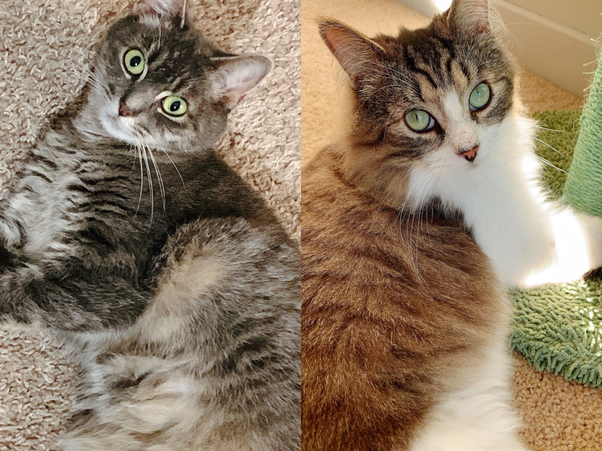

# Life Beyond Work

In parallel to my research, I serve as a member of the Graduate Student Committee in the Psychology Department and a member of the Diversity and International Students Committee in the Graduate and Professional Student Assembly.

I also work as a volunteering mentor for Extended Project Qualification, assisting high school students with their first social science projects. 

During my leisure, I enjoy spending time with my cats, handcrafting, and hiking. 
 
