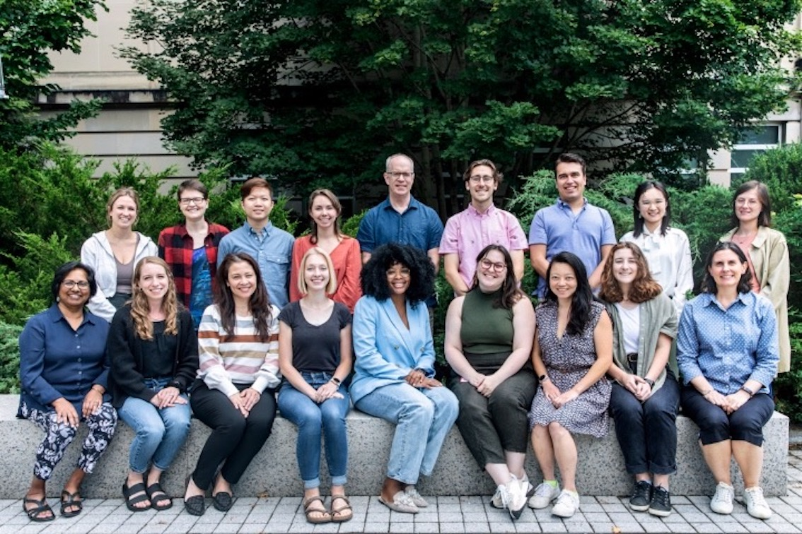

# Life Beyond Work

In parallel to my research, I serve as a member of the Graduate Student Committee in the Psychology Department, a teaching fellow at the Center for Teaching Innovation (CTI), and a member of the Diversity and International Students Committee (DISC) in the Graduate and Professional Student Assembly.

 

I also work as a graduate mentor in the Graduate Students Mentoring Undergraduates program directed by the Office of Academic Diversity Initiatives at Cornell, and a mentor for Extended Project Qualification in Beijing, China, assisting high school students with their first social science projects. 

During my leisure, I enjoy spending time with my cats, handcrafting, and hiking. 
 
