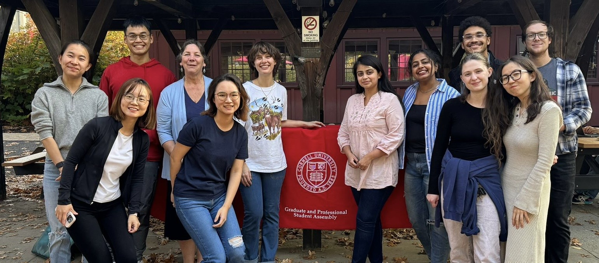
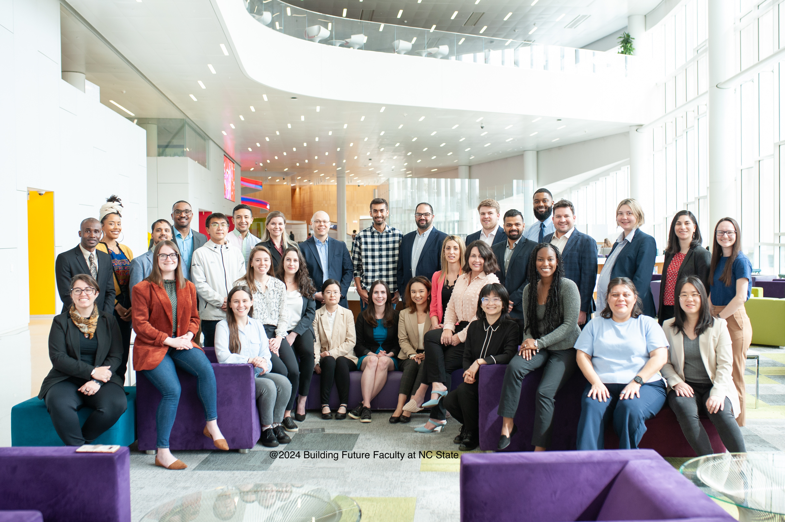
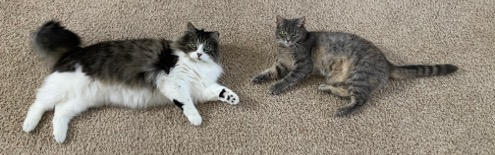

## Serve the Community
In parallel to my research, I have served as a senior graduate student representative in the **Graduate Student Committee** in the Psychology Department between 2022 and 2024. 

During 2023-25, I am also a founding member of the **Diversity and International Students Committee (DISC)** in the [Graduate and Professional Student Assembly](https://assembly.cornell.edu/shared-governance-cornell/graduate-and-professional-student-assembly).

  

I also served on the **Cornelia Ye Teaching Assistant Award Selection Committee** in 2024 and on the **International Teaching Assistant Program Advisory Committee** since then.

## Beyond Cornell
In 2024, I was selected for the **Building Future Faculty Program** at North Carolina State University. During the two-and-a-half-day stay, I presented my dissertation work to the current faculty in the Department of Psychology at NC State, and attended sessions that covered life as a faculty member at a research-extensive university, expectations of new faculty, and the resources available for research and teaching. Moreover, I got the chance to meet with scholars from other institutes and disciplines. I have also attended the **Computational Modeling Workshop** held by [SRNDNA](https://srndna.utdallas.edu/) at the University of Pennsylvania, where I had an immersive learning experience of the latest computational models in decision science.

  

## For Fun!
During my leisure, I enjoy spending time with my cats, handcrafting, and hiking. 

  

