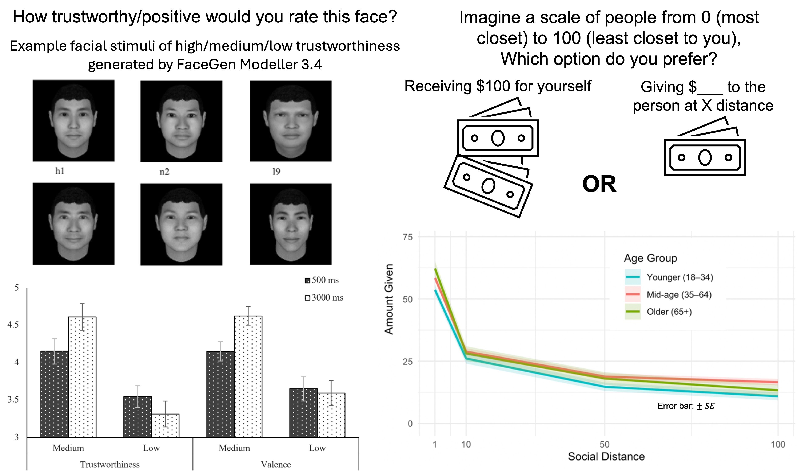

  

     
    
     
  

  

    

      According to the Socioemotional Selectivity Theory (Carstensen, 1992), as people age, they prioritize their social and emotional goals. This shift has important implications for older adults’ judgment and decision-making, particularly given their heightened vulnerability to elder abuse and financial fraud. My ongoing work aims to uncover the age-related differences in judgments and decisions in social contexts.

 

<b>Selected Work</b>

  <b>Lu, Y.</b>, Chen, C., Yin, X., Xu, Y., & Zhang, X. (2021). Viewing time and facial trustworthiness perception: Giving it a second thought may not work for older adults. <i>PsyCh Journal</i>. [<a href="https://doi.org/10.1002/pchj.469">Link</a>]
  
   
  <b>Lu, Y.</b>, Goscicki, B., & Löckenhoff, C. E. (in revision). Age differences in social discounting and charitable giving in a U.S. sample.
  
   
  <b>Lu, Y.*</b>, Lin, H.* Löckenhoff, C. E., Zhang, X., & Fung, H. H. (in revision). Age differences in social discounting and charitable giving in the U.S. and China.

    

  

