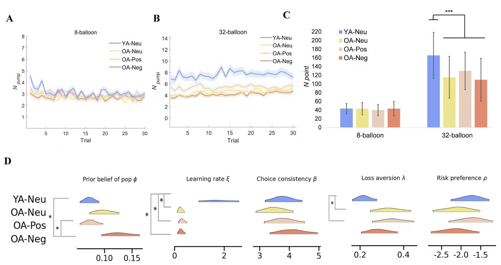

  

    

      <b>Applying advanced methods to research.</b> My doctoral research employed advanced quantitative methods to investigate age-related differences in self-continuity and decision-making. These approaches address methodological gaps in prior literature, allow for the detection of nuanced effects, and enable deeper investigation into the mechanisms underlying observed age differences.
       
      <b>Open science practices.</b> I am committed to conducting transparent and reproducible research and share my pre-registrations, analysis scripts, study materials, and/or data through publication supplements and platforms including AsPredicted.org and OSF.io.
    

  

  

     
    
     
  

