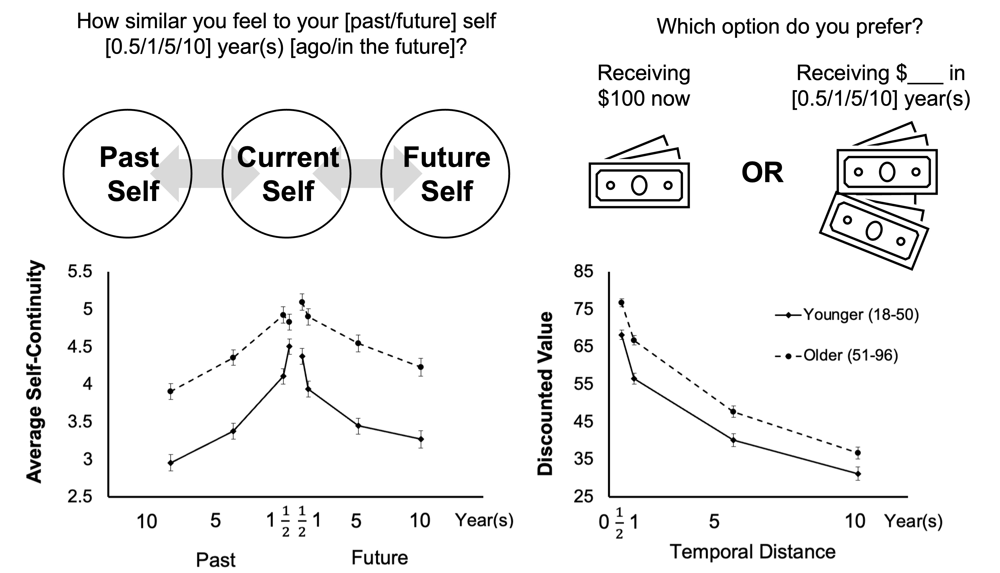

  

    

      How we perceive ourselves plays a vital role in shaping our decisions. For older adults, age-related changes in cognitive resources present unique challenges to decision-making. In response, I examine how older adults’ view of future selves and their age group influence decision-making in intertemporal and risky contexts.
       
      

      
<b>Selected Work</b>

         
        <b>Lu, Y.</b>, Rutt, J., Thomas, M., & Löckenhoff, C. E. (2025). Modeling temporal self-continuity and its association with temporal discounting. <i>Personality and Individual Differences</i>. [<a href="https://doi.org/10.1016/j.paid.2025.113354">Link</a>]
         
        <b>Lu, Y.*</b>, Liao, S.*, Ma, G., Guo, Z., Li, T., Zhou, Y., Sun, Y. Y., & Zhang, X. (2026). The impact of age-related stereotypes on risky decision-making in the Balloon Analogue Risk Task: Shifts in prior beliefs rather than loss aversion. <i>The Journal of Gerontology: Series B</i>
      

    

  

    

       
    
       
  

