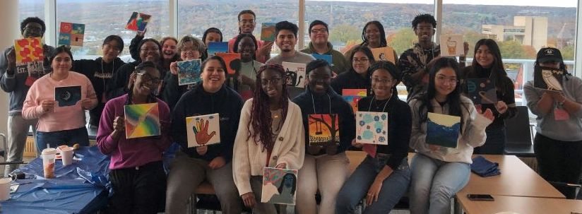

At the **Healthy Aging Lab**, I have been mentoring a group of 1-4 undergraduate research assistants for each semester since 2023. 

One of my mentees, Adelyn Yu ('25), presented her project on personality traits and social discounting at the 2025 annual conference of the [Eastern Psychological Association](https://www.lois-lu.com/talk/epa-2025-agreeableness-is-associated-with-increased-generosity-in-social-discounting-and-charitable-giving/). After graduating, Adelyn was admitted to UCLA’s Master of Social Work program and plans to advance her career path as a counseling psychologist.

I also served as a **graduate mentor** in the [Graduate Students Mentoring Undergraduates program](https://oadi.cornell.edu/signature-programs/graduate-students-mentoring-undergraduates) at Cornell's Office of Academic Discovery and Impact, and provided my guidance and support to undergraduates from underrepresented groups. 

At the graduate level, I served as a volunteer tutor for the *Consider Cornell* graduate diversity recruitment weekend and a mentor for the first-year Ph.D. students at the Department of Psychology.

  

