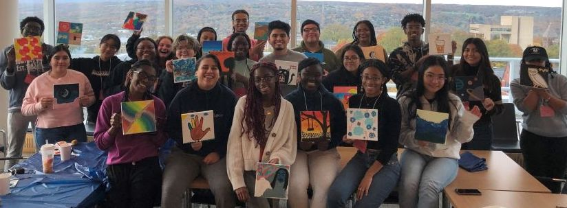

At the **Healthy Aging Lab**, I have been mentoring a group of 1-4 undergraduate research assistants for each semester since 2023. 

My undergraduate mentee and RAs, Adelyn Yu ('25), Riya Kumar ('26), Michael Zhong ('27), and Justin Taveras ('27), presented their projects at Cornell Undergraduate Research Forum, poster symposium of [Bronfenbrenner Center for Translational Research](https://bctr.cornell.edu/postersymposium/), and annual conferences of the [Eastern Psychological Association](https://www.lois-lu.com/talk/epa-2025-agreeableness-is-associated-with-increased-generosity-in-social-discounting-and-charitable-giving/). 

I also served as a **graduate mentor** in the [Graduate Students Mentoring Undergraduates program](https://oadi.cornell.edu/signature-programs/graduate-students-mentoring-undergraduates) at Cornell's Office of Academic Discovery and Impact, and provided my guidance and support to undergraduates from underrepresented groups. 

At the graduate level, I served as a volunteer tutor for the *Consider Cornell* graduate diversity recruitment weekend and a mentor for the first-year Ph.D. students at the Department of Psychology.

  

