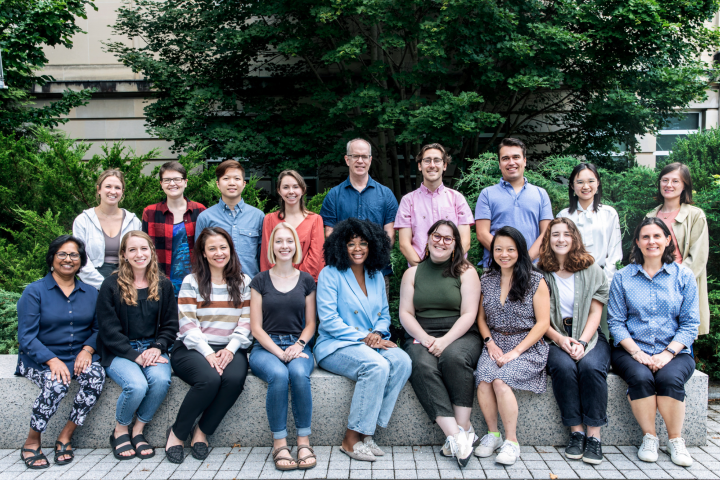

# Teaching Philosophy
As a developmental psychologist and gerontologist, my teaching philosophy is centered on the belief that the ultimate goal of education is for personal fulfillment and lifespan development. To achieve this goal, I implement the following elements in my teaching: 
- **Inclusivity**. Being an international student myself, I understand the importance of creating an inclusive classroom environment. With Cornell CTI lead fellows, we discussed Bell Hooks' *Teaching to Transgress* and Paulo Freire's *Pedagogy of the Oppressed*.
- **Independence**. I believe that autonomy in learning is crucial for students’ success in transitioning from high school to undergraduate and graduate studies. To achieve this goal, *scaffolding* is necessary, and the foundation of scaffolding is to create a secure attachment between the instructor and students.
- **Integrative design**. I am committed to designing integrative courses via pedagogical and psychological methods. An integrative course combines reinforcement among learning goals, teaching/learning activities, and feedback/assessments with attention to situational factors.

# Center for Teaching Innovation
I was awarded the teaching fellowship at [Cornell Center for Teaching Innovation (CTI)](https://teaching.cornell.edu/grants-awards/graduate-students-postdoctoral-fellows) since 2023 and am currently a **senior lead fellow** at CTI, co-leading a group of 20 graduate teaching fellows from different disciplines across the campus. At CTI, we design and implement teaching programs, events, and resources that foster teaching excellence and innovation. As a senior lead fellow, I also develop leadership and mentorship skills, reflect on and refine my teaching skills, enhance my communication skills, and foster collaborative, interdisciplinary teaching networks across the university, such as the [Ivy+ Teaching Transformation Summit](https://ctl.columbia.edu/graduate-instructors/programs-for-graduate-students/seminars-institutes-for-graduate-students/teaching-transformations/).

  

# Teaching Interests and Experience
I am prepared to teach a range of introductory and advanced courses in **aging and lifespan development**, **judgment and decision making**, **self and identity**, and **social psychology**. I am also prepared to teach **research methods and statistics** at both the undergraduate and graduate levels, including experiment design, measurements, and quantitative methods such as multilevel modeling.

## Instructor of Record
### [HD2180] *Human Development: Adulthood and Aging*
Offered term: Summer 2025, online

Course Aim

 
What do we gain and lose as we age? How do our relationships change over time? How does population aging influence our society? How should we approach aging research, and how can we translate our findings into concrete policies? This course provides an overview of biological, cognitive, and socio-emotional development across the adult life span with a particular focus on the later years. We will consider what age-related changes mean for research, clinical, and policy settings. Different aspects of development will be integrated within a multidisciplinary life-span developmental framework.

Specific Learning Objectives

 
By the end of this course, you will: 
  
- Describe changes in different aspects of functioning across the adult life span
- Integrate theoretical perspectives on aging across disciplines
- Read and understand contemporary research in gerontology
- Translate current findings in the aging literature to policy, programs, and practice
- Recognize the great diversity and resilience among older people
- Re-examine your personal attitudes about older people and your own aging process

### [HD1130/PSYCH1131] *Introduction to Human Development*
Offered term: Summer 2024, online

Course Aim

 
Introduction to Human Development provides a broad and foundational overview of the field of human development, starting from conception and ending through the process of death and dying. The course will start with an outline and explanation of the lifespan perspective in human development. The biological beginnings of life and prenatal development will serve as the start of the discussion of human development, followed by an exploration of physical, cognitive, and socioemotional development at each subsequent stage within the lifespan (e.g., infancy, early, middle & late childhood, etc.). Discussion of each developmental stage will highlight major research findings and their real-world application. 

Specific Learning Objectives

 

By the end of this course, you will: 
-	Develop a broad but strong base of knowledge surrounding the field of human development and how human development research is conducted. 
-	Be able to read, understand, and critically think about current research in the field of human development and how research can be applied to the real world. 
-	Gain an understanding of the different developmental stages and what kind of change is occurring across the domains of physical, cognitive, and socioemotional development. 
-	Consider your beliefs about development before the course and reconsider the beliefs that are not supported by research. 
-	Find this class fun and interesting, taking what you learned from the course and being able to apply it in your daily life!

## Guest Lectures and Workshops Given
### Cognitive Aging for [COGST 1101] *Introduction to Cognitive Science*
In this lecture, we discussed the age-related changes in the brain, attention, and memory with a special focus on older adulthood. After this lecture, students had an understanding of neurobiological changes in brain structure and functions and age differences in different types of attention and memory across various contexts, with practical advice on their preparation for the aging process and interactions with older adults.

### Essentials of Teaching Institute
In this four-part workshop series we developed, participants will explore strategies to foster a positive classroom environment, create effective interactive teaching activities to help students learn, and develop fair methods for assessment and grading. Since 2023, I have instructed all four workshops in this institute covering the following topics:
1. Role of TAs in Cultivating an Inclusive Classroom
2. Supporting Student Learning as a TA
3. Effective Grading and Feedback
4. Final Session: Discussion of an Action Plan

### Teaching Portfolio Program
In this in-person program, I co-instructed two workshops for graduate TAs and instructors-in-training on developing Teaching Philosophy Statements and Inclusivity Statements.

